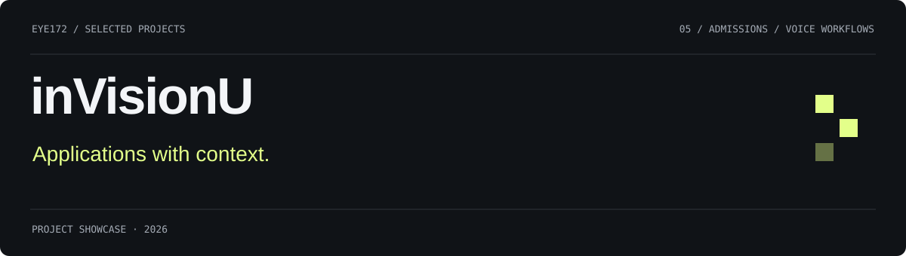
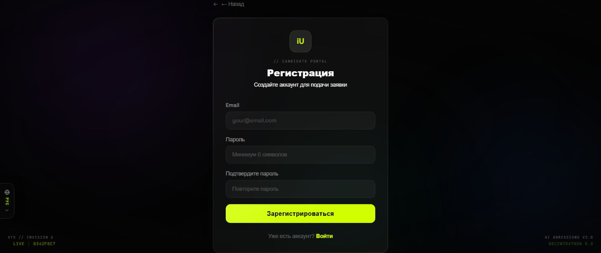
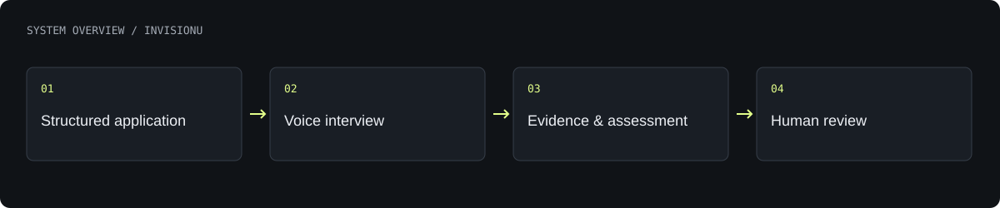

# inVisionU

A structured application and interview workflow that gathers evidence and explanations for human admissions reviewers.

**Decentrathon 5.0 · QwertyS · hackathon MVP**

[What is built](#what-is-built) · [Architecture](#architecture) · [Authors](#authors) · [Profile](https://github.com/Eye172) · [Source code](https://github.com/Eye172/decentrathon5-project-v2)

## Product gallery

Screenshot of the local application interface.

## What is built

- Collect a profile, life timeline, essay and situational judgement responses.
- Generate interview prompts and support recorded voice interviews.
- Combine transcription and criterion-based assessments in a reviewer dashboard.
- Keep final review with people; provide English, Russian and Kazakh interfaces.

## Architecture

The web application connects applicant and commission interfaces to an API for applications, interview sessions and review. Speech services provide transcription and spoken prompts. Model-assisted assessments sit beside a rule-based baseline.

**Technology:** React · TypeScript · Vite · Python · FastAPI · SQLite · Anthropic · Whisper · TTS.

## Current scope

A hackathon prototype. Experimental gaze and facial signals are not validated measures of honesty or suitability. Product-interface marketing figures are not presented here as measured evaluation results.

## Authors

**QwertyS** — [Shakhnazar Akhmer](https://github.com/Eye172) and [Nurkhan Aimukatov](https://github.com/pip00sya).

## About this repository

This is a standalone project showcase containing a product description, visuals and a high-level architecture overview. The implementation is available in the linked source repository. No deployment is required to explore this page.

[Contact](mailto:shakh090909@gmail.com) · [GitHub profile](https://github.com/Eye172)
