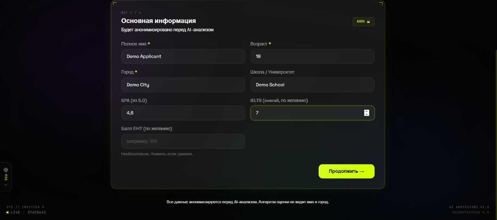
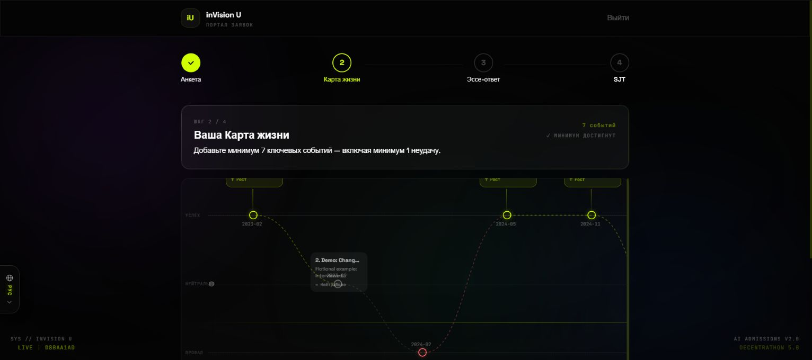
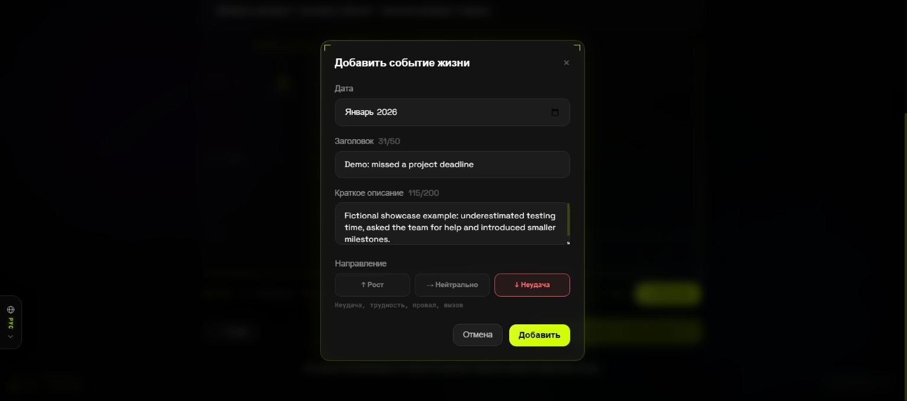
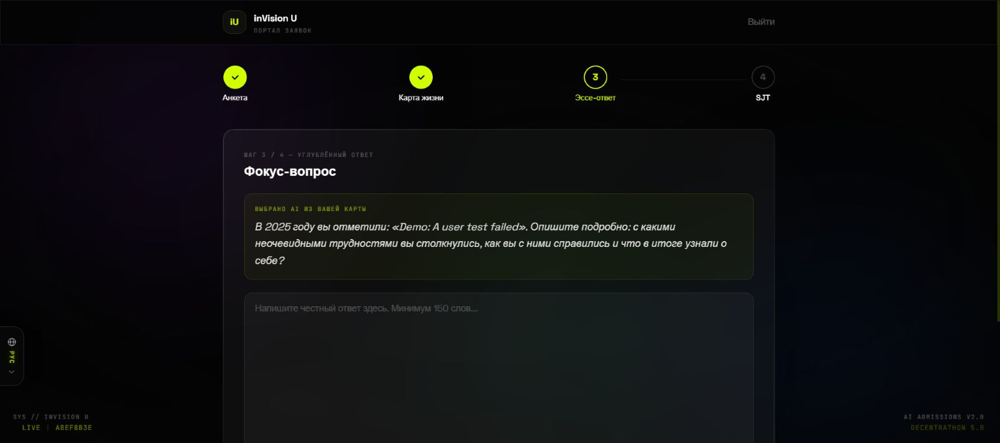

# inVision U
### A fuller application story, organized for review.

A candidate-selection prototype connecting an applicant journey with an anonymous commission workspace. It collects structured context, written responses and an interview so reviewers can inspect a coherent application instead of switching between disconnected forms and files.

*The first application stage, restored locally with a fictional Demo Applicant profile. No real applicant record is shown.*

## An application has a narrative

Grades and a short essay rarely explain how someone approached a difficult experience. inVision U’s candidate flow includes a profile, a life timeline, an essay, situational-judgment tasks and a short live interview. The timeline includes difficult experiences as well as achievements, giving the later conversation more context.

The interface supports English, Russian and Kazakh. Rather than making the applicant complete unrelated tools, it carries the candidate through distinct stages with a completion state at the end.

*The actual life-map interface with seven explicitly fictional demo events. Upward, neutral and downward moments form a navigable application narrative.*

### Build a timeline, then examine a moment

Events contain a date, a short title, a description and a direction: growth, neutral change or setback. The form requires at least seven events, including a setback, before proceeding. This produces structured context for the later response rather than an unbounded autobiography.

*The event editor captures a setback and a short reflection. All text was written as a fictional UI fixture for this showcase.*

After the timeline, the prototype selects a moment and asks for a 150–300-word response. In this local path, the prompt is assembled by a deterministic fallback from the selected event; the UI label does not establish that a live AI call occurred.

*The focused-response stage is connected to an event from the demo timeline. The empty response is deliberate; no applicant essay or assessment was fabricated.*

## The applicant journey

| Stage | Material collected | Purpose in the workflow |
|---|---|---|
| Profile | Structured background and academic context | Establish the application record |
| Life timeline | Experiences and reflections | Provide context beyond a list of achievements |
| Essay | A longer written response | Preserve the applicant’s own explanation |
| Situational judgment | Responses to concrete situations | Add task-specific evidence |
| Interview | Four questions, transcript and recorded response | Extend the evidence available for review |

The interview path uses model-generated questions and speech services. Speech-to-text converts the answer into reviewable text; text-to-speech delivers prompts, with browser speech as a fallback path. The transcript and recording are related evidence, but are not interchangeable.

## A different workspace for the commission

The commission view uses anonymous candidate identifiers and omits names and schools from the comparison surface. Reviewers can inspect a candidate’s evidence, recorded interview and assessment output, and adjust evaluation weights. A ranking is therefore a starting point for review, not the only artifact the system exposes.

~~~mermaid
flowchart LR
 A[Candidate profile] --> B[Timeline and essay]
 B --> C[Situational tasks]
 C --> D[Four-question interview]
 D --> E[Transcript and recording]
 E --> F[Assessment context]
 F --> G[Anonymous commission dashboard]
 G --> H[Evidence inspection and human review]
~~~

### Why role separation matters

Candidates and commission members do different work and need different views of the same application. The backend uses authenticated roles, while the commission interface emphasizes candidate IDs and comparative review. This reduces unnecessary identity exposure in that view; it does not prove that anonymous presentation eliminates bias.

## Engineering the interview path

The frontend uses **React 19, TypeScript, Vite, Tailwind, Framer Motion and multilingual resources**. The API uses **FastAPI, SQLAlchemy, SQLite and role-based access with opaque session tokens**. Anthropic-backed question/evaluation services, Whisper speech recognition and speech output support the interview workflow.

Live interview sessions are held in memory in the prototype, so a server restart can interrupt a session. Transcripts are stored and recorded video is uploaded as WebM. The implementation also explored MediaPipe face-landmark telemetry; this showcase does not treat such signals as proof of honesty, personality or suitability.

## What is built, and what is not established

The implemented result is an end-to-end application and review prototype with candidate stages, speech interaction, recordings and an anonymous commission surface. Assessment validity, fairness outcomes and production-scale privacy controls are not established by the presence of those features.

The screenshots show the working candidate forms with a clearly fictional local demonstration account. No real applicant material, completed interview or assessment score is shown. The technical result is the integration of a multi-stage candidate journey with the evidence a human reviewer needs to examine.

[Explore the public Decentrathon source repository](https://github.com/Eye172/decentrathon5-project-v2).

---

### Built by

**QwertyS** — [Shakhnazar Akhmer](https://github.com/Eye172) and [Nurkhan Aimukatov](https://github.com/pip00sya).

[More projects](https://github.com/Eye172) · [Contact](mailto:shakh090909@gmail.com)

This repository presents the product and its engineering. Implementation and internal data are maintained separately. Screenshots and documented experiments are identified in their captions.
